# DeepSeek-V4 Inference Model 网络结构图

本文档详细绘制了 `inference/model.py` 中各个子模块的网络结构。

---

## 1. Transformer 整体架构

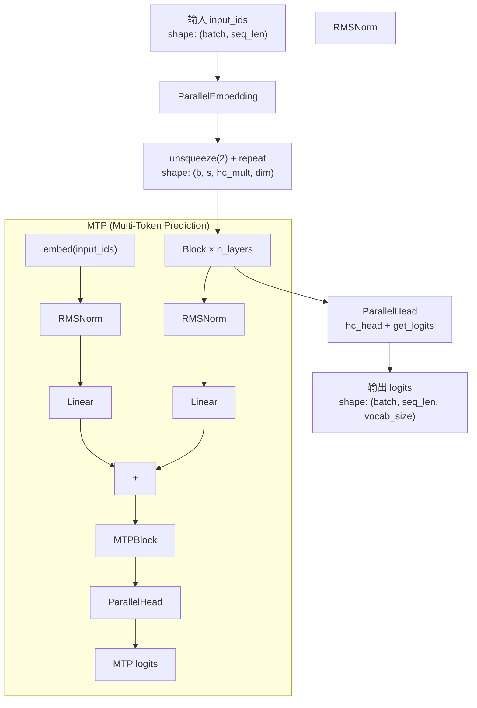

---

## 2. ParallelEmbedding

词嵌入层，沿词表维度做张量并行切分。

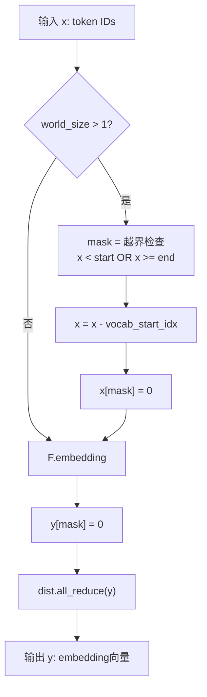

---

## 3. Linear / ColumnParallelLinear / RowParallelLinear

### 3.1 Linear（基础线性层，支持 FP8/FP4）

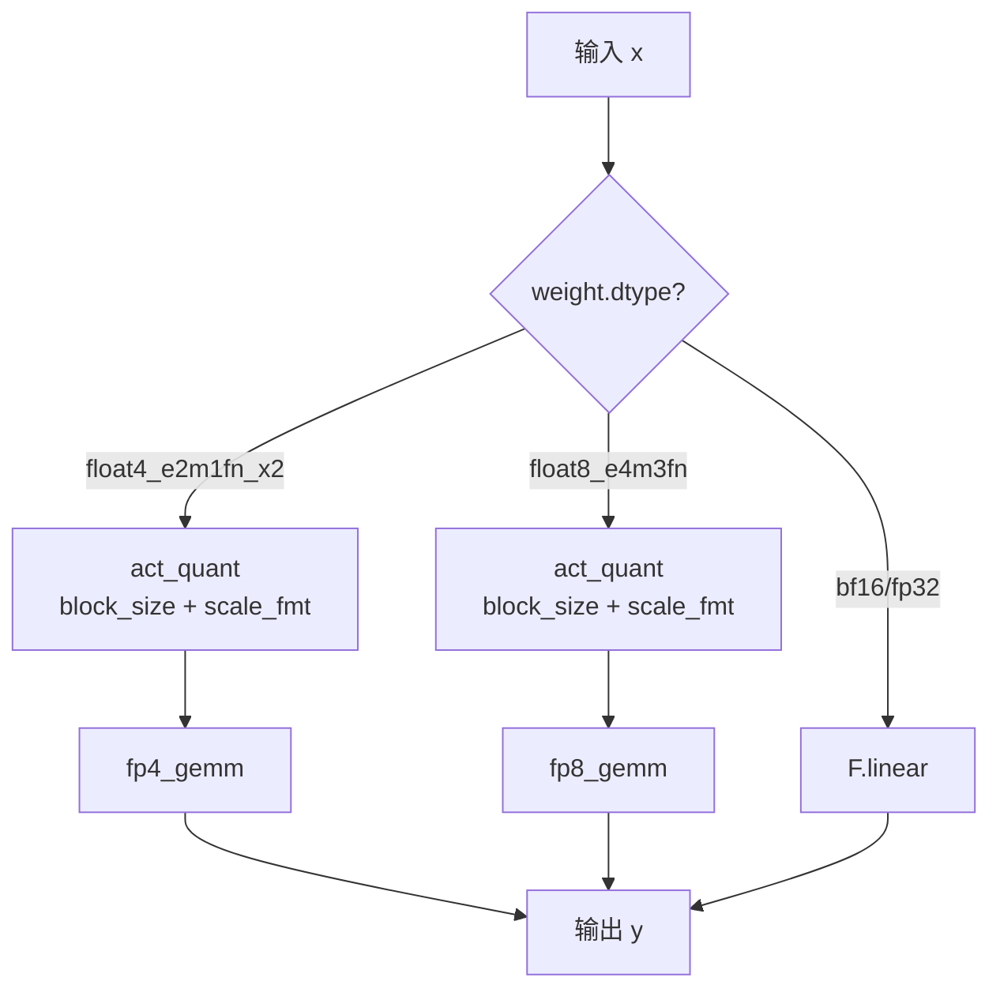

### 3.2 ColumnParallelLinear（输出维度切分）

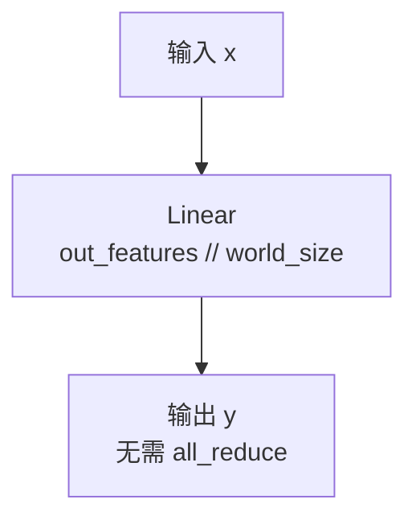

### 3.3 RowParallelLinear（输入维度切分）

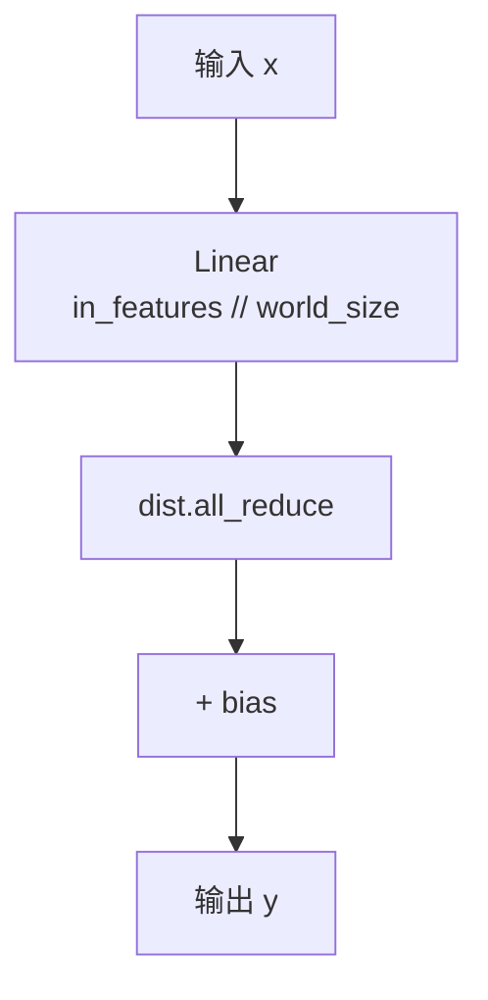

---

## 4. RMSNorm

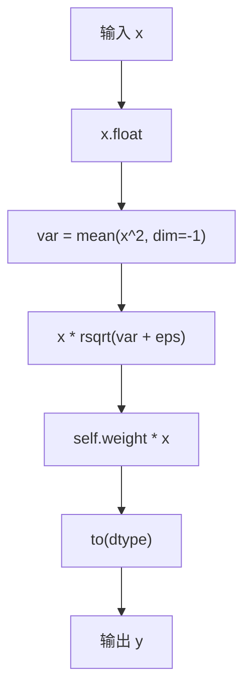

---

## 5. Compressor（KV Cache 压缩器）

通过门控池化将连续 `compress_ratio` 个 token 压缩为 1 个。

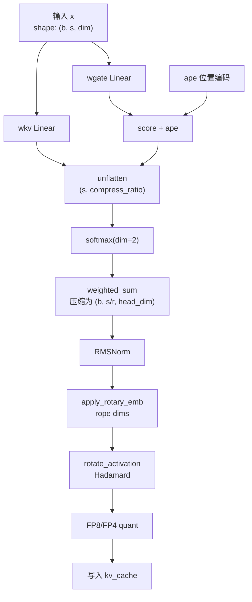

---

## 6. Indexer（稀疏注意力索引器）

选择 Top-K 压缩 KV 位置用于稀疏注意力。

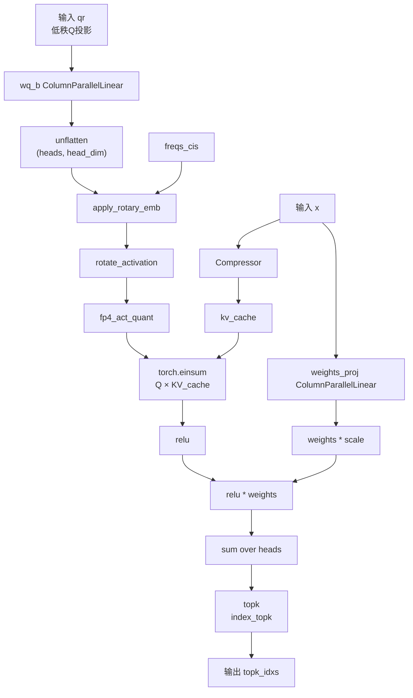

---

## 7. Attention（MLA - Multi-head Latent Attention）

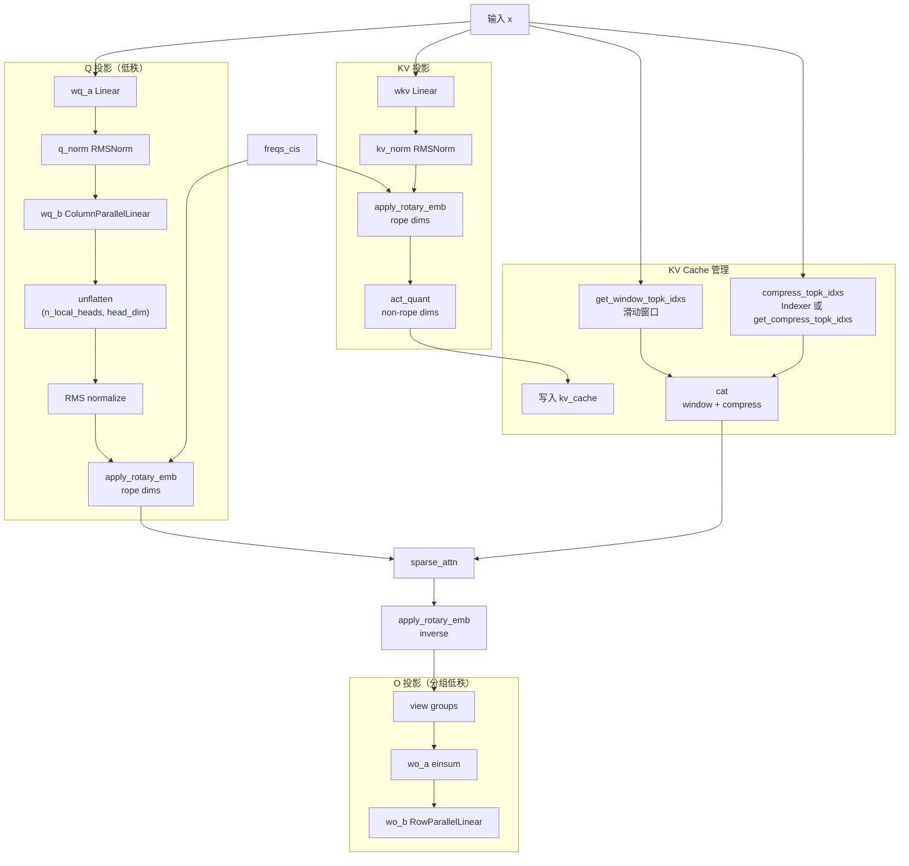

---

## 8. Gate（MoE 门控）

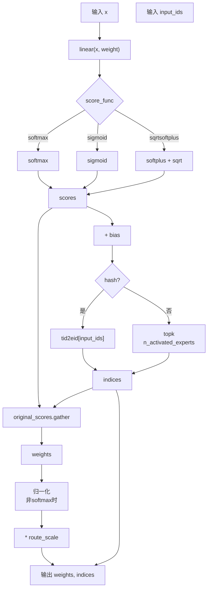

---

## 9. Expert（单个 MoE 专家）

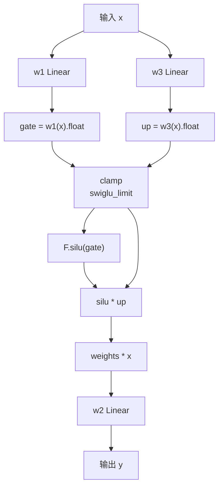

---

## 10. MoE（Mixture-of-Experts）

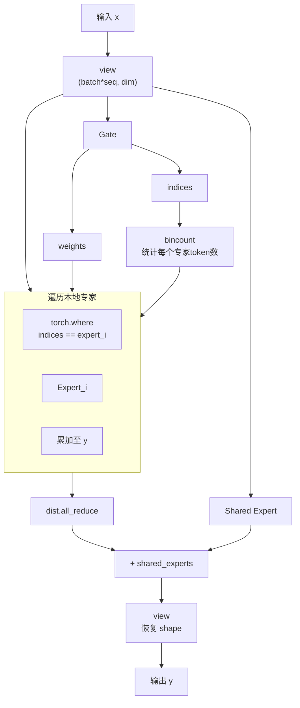

---

## 11. Block（Hyper-Connections Transformer Block）

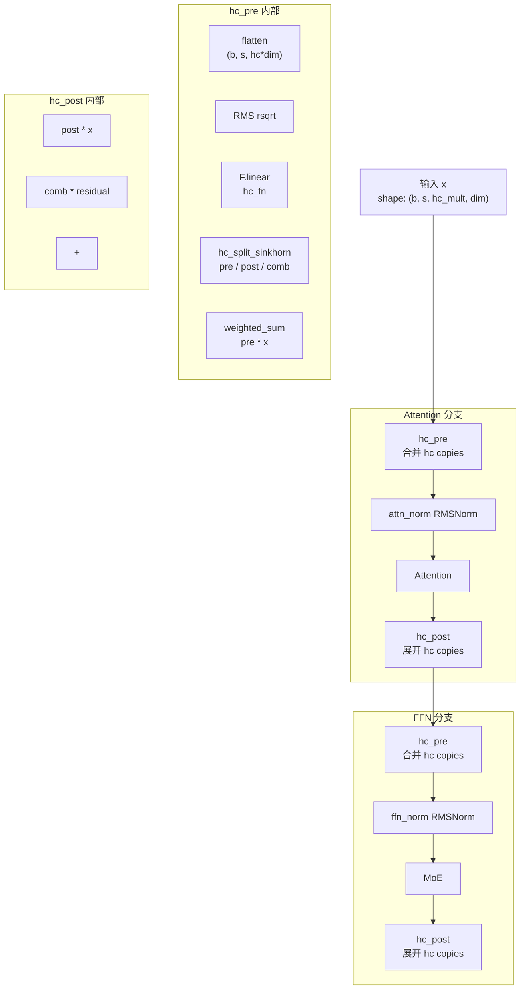

---

## 12. MTPBlock（Multi-Token Prediction Block）

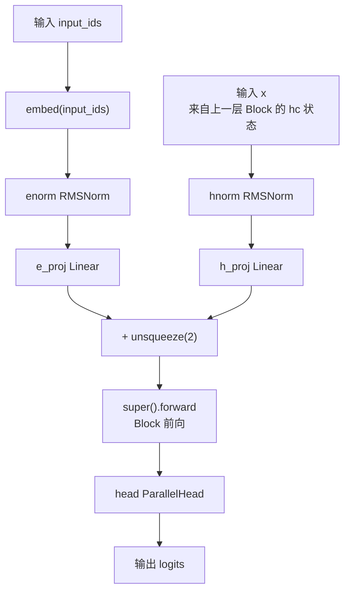

---

## 13. ParallelHead（输出头）

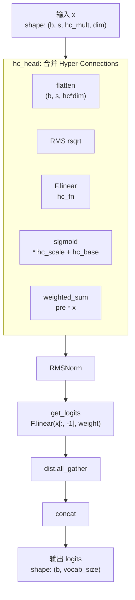

---

## 14. 数据流形状变化总览

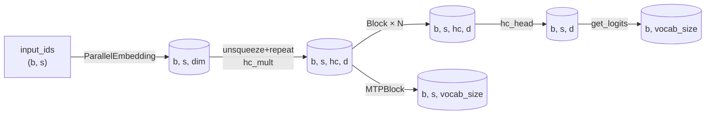

---

## 15. 模块依赖关系图

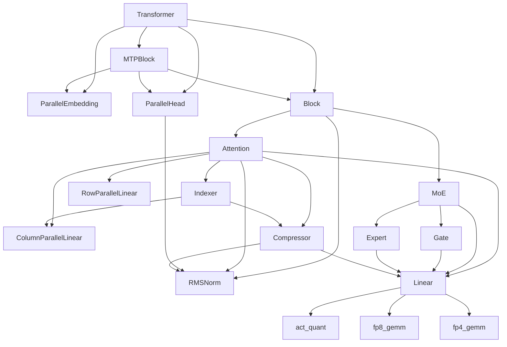
