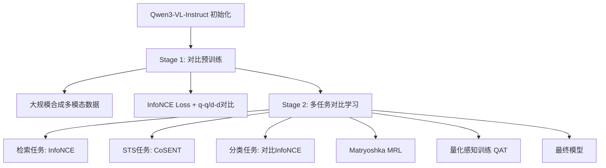

# Qwen3-VL-Embedding 损失函数与模型训练过程分析

## 基本信息
- **论文标题**: Qwen3-VL-Embedding and Qwen3-VL-Reranker: A Unified Framework for State-of-the-Art Multimodal Retrieval and Ranking
- **作者**: Mingxin Li, Yanzhao Zhang, Dingkun Long, Keqin Chen, Sibo Song, Shuai Bai, Zhibo Yang, Pengjun Xie, An Yang, Dayiheng Liu, Jingren Zhou, Junyang Lin (Qwen Team)
- **发表时间**: 2026年1月 (arXiv:2601.04720)
- **论文链接**: https://arxiv.org/abs/2601.04720

## 模型架构概述

### 双塔架构 (Dual-Tower Architecture)
Qwen3-VL-Embedding采用双塔独立编码架构：
- **输入处理**: 支持文本、图像、截图、视频及混合模态输入
- **嵌入提取**: 从基础模型最后一层提取 `[EOS]` token 对应的隐藏状态向量作为最终语义表示
- **优势**: 支持高效的独立编码，适合大规模检索场景

### 模型规格
| 模型 | 参数量 | 层数 | 序列长度 | 嵌入维度 | 量化支持 | MRL支持 |
|------|--------|------|----------|----------|----------|---------|
| Qwen3-VL-Embedding-2B | 2B | 28 | 32K | 2048 | ✅ | ✅ |
| Qwen3-VL-Embedding-8B | 8B | 36 | 32K | 4096 | ✅ | ✅ |

---

## 多阶段训练范式

Qwen3-VL-Embedding采用多阶段训练流程，从大规模对比预训练逐步过渡到精细化的多任务学习。

### Stage 1: 大规模对比预训练 (Contrastive Pre-training)

**目标**: 对齐多模态表示空间，增强对各种模态、任务和领域的世界知识理解

**训练数据**:
- 大规模合成多模态数据
- 基于 Qwen3-VL-Instruct 模型进行初始化

**损失函数**: 标准 InfoNCE Loss

$$
\mathcal{L}_{\text{InfoNCE}} = -\sum_{i=1}^{N} \log \frac{\exp(\text{sim}(q_i, d_i^+))}{\sum_{j=1}^{N} \exp(\text{sim}(q_i, d_j))}
$$

其中：
- $\text{sim}(q, d) = \frac{h_q^T h_d}{\|h_q\| \|h_d\|}$: 余弦相似度
- $N$: 批内样本数量（包含正样本和批内负样本）
- $q_i$: 查询嵌入
- $d_i^+$: 正样本文档嵌入
- $d_j$: 批内所有文档（包括正样本和负样本）

**特点**:
- 使用 In-Batch Negative: 批内其他样本作为负样本
- 高效利用批内样本，无需额外生成负样本
- 第一阶段包含 q-q 和 d-d 的对比学习部分（相同模态间的对比）

---

### Stage 2: 多任务对比学习 (Multi-Task Contrastive Learning)

**目标**: 针对不同任务类型进行精细化微调，集成 Matryoshka 表示学习和量化感知训练

**训练数据**: 检索任务数据和 STS (Semantic Textual Similarity) 任务数据

**关键变化**: 第二阶段去掉了 q-q 和 d-d 的对比学习部分，专注于跨模态检索

#### 任务分类与对应损失函数

| 任务类型 | 损失函数 | 适用场景 |
|----------|----------|----------|
| 检索任务 (Retrieval) | InfoNCE Loss | 查询-文档检索、图像-文本检索、视频-文本匹配 |
| STS任务 | CoSENT Loss | 语义文本相似度、成对分类 |
| 分类任务 (Classification) | 对比学习形式 InfoNCE | 文本/图像分类、聚类 |

#### 2.1 检索任务损失 - InfoNCE Loss

对于检索任务，继续使用标准的 InfoNCE 对比损失：

$$
\mathcal{L}_{\text{retrieval}} = -\log \frac{\phi(q, d^+)}{\phi(q, d^+) + \sum_{n_i \in \mathbb{N}} \phi(q, n_i)}
$$

其中：
- $\phi(q, d) = \exp(\frac{\text{sim}(q, d)}{\tau})$: 相似度得分
- $\tau$: 温度参数
- $\mathbb{N}$: In-batch负样本 + 困难负样本

**困难负样本挖掘**: 动态更新困难负样本以保持训练效果

#### 2.2 STS任务损失 - CoSENT Loss

CoSENT (Cosine Sentence) Loss 用于语义文本相似度任务：

$$
\mathcal{L}_{\text{CoSENT}} = \log \left(1 + \sum_{\text{sim}(i,j) > \text{sim}(k,l)} e^{\frac{\lambda(\cos(u_k, u_l) - \cos(u_i, u_j))}{\tau}}\right)
$$

其中：
- $\tau$: 温度参数
- $\cos(\cdot)$: 余弦相似度函数
- $\text{sim}(i,j) > \text{sim}(k,l)$: 标注相似度更高的样本对
- $u_i, u_j$: 样本对的嵌入向量

**优势**:
- 相比传统交叉熵损失，CoSENT Loss 在STS任务上表现更好
- 直接优化相似度排序关系

#### 2.3 分类任务损失

对于文本或图像分类任务，同样采用对比学习形式：

$$
\mathcal{L}_{\text{classification}} = -\log \frac{\exp(\text{sim}(x, x^+)/\tau)}{\sum_{c=1}^{C} \exp(\text{sim}(x, x_c)/\tau)}
$$

其中同一类别的样本作为正样本，其他类别的样本作为负样本。

---

## Matryoshka Representation Learning (MRL)

### 核心思想

Matryoshka Representation Learning（俄罗斯套娃表示学习）允许单个嵌入向量在不同维度上保持有效性，实现灵活的嵌入维度选择。

### 实现方式

**训练时的嵌套损失**:
在训练过程中，对多个预定义的维度计算损失并累加：

$$
\mathcal{L}_{\text{MRL}} = \sum_{m \in \mathcal{M}} w_m \cdot \mathcal{L}_m
$$

其中：
- $\mathcal{M}$: 预定义的维度集合（如 {64, 128, 256, 512, 1024, 2048}）
- $\mathcal{L}_m$: 在维度 $m$ 上计算的对比损失
- $w_m$: 各维度的权重（通常均等）

**推理时截断**:
直接截取嵌入向量的前缀部分作为低维表示：

$$
h_{\text{truncated}} = h[:d] \quad \text{for } d \in \{64, 128, 256, ...\}
$$

### 优势
1. **灵活性**: 同一模型支持多种嵌入维度需求
2. **效率**: 可根据计算资源选择合适的维度
3. **无额外推理成本**: 截断操作无计算开销
4. **性能保持**: 截断后的低维嵌入与独立训练的低维模型性能相当或更好

---

## Quantization-Aware Training (QAT)

### 目标
使模型在量化部署后仍保持良好性能

### 实现方式
- 在训练过程中引入量化噪声模拟量化效果
- 使模型学习对量化误差的鲁棒性
- 支持部署时的 INT8/INT4 量化

### 优势
1. **部署灵活性**: 支持量化部署场景
2. **性能保持**: 量化后模型性能下降最小化
3. **资源节省**: 降低存储和计算成本

---

## 总损失函数

综合所有技术，Qwen3-VL-Embedding的总损失函数可表示为：

$$
\mathcal{L}_{\text{total}} = \mathcal{L}_{\text{task}} + \mathcal{L}_{\text{MRL}} + \mathcal{L}_{\text{QAT}}
$$

其中：
- $\mathcal{L}_{\text{task}}$: 根据任务类型选择的损失（InfoNCE/CoSENT）
- $\mathcal{L}_{\text{MRL}}$: Matryoshka嵌套损失
- $\mathcal{L}_{\text{QAT}}$: 量化感知训练的额外损失项

---

## 训练流程总结

---

## 关键技术特点

### 1. 多模态统一表示
- 文本、图像、视频映射到同一语义空间
- 支持跨模态检索（图文检索、视频检索等）

### 2. 指令感知 (Instruction-Aware)
- 查询端支持任务指令定制
- 格式: `Instruct: {task_definition}\nQuery: {query}`

### 3. 长上下文支持
- 支持最多32K tokens输入
- 适合文档级检索任务

### 4. 多语言支持
- 支持30+语言
- 继承Qwen3-VL的多语言能力

---

## 实验结果

Qwen3-VL-Embedding-8B 在 MMEB-V2 基准测试上取得 **77.8** 的总分，排名第一（截至2026年1月）。

---

## 总结

Qwen3-VL-Embedding通过多阶段训练、多任务混合损失、Matryoshka表示学习和量化感知训练，实现了统一的多模态嵌入学习。其核心创新在于：

1. **任务自适应损失**: 不同任务使用最优损失函数
2. **维度自适应表示**: MRL支持灵活嵌入维度
3. **部署自适应优化**: QAT支持量化部署
4. **模态统一架构**: 双塔设计支持高效多模态检索